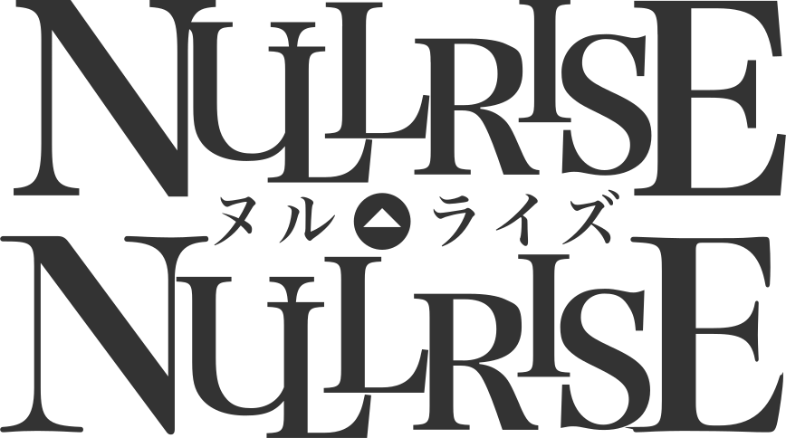
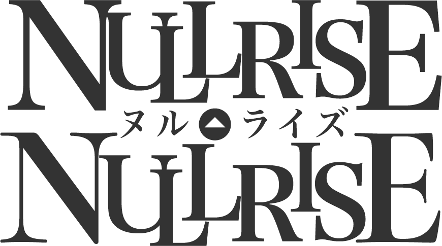
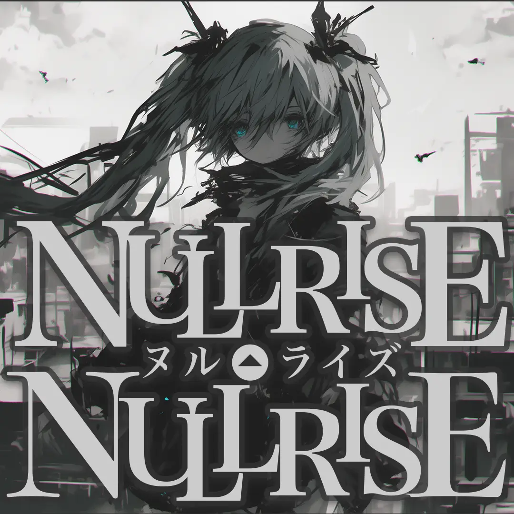
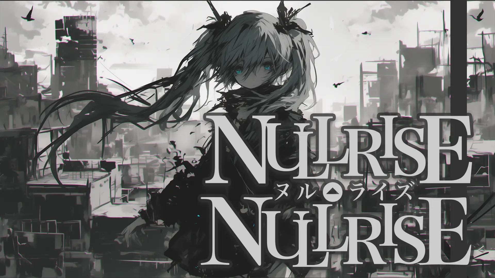
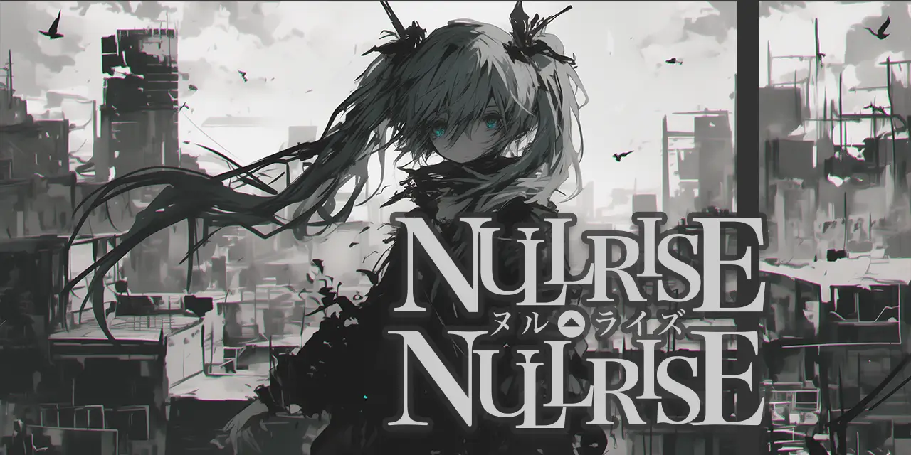
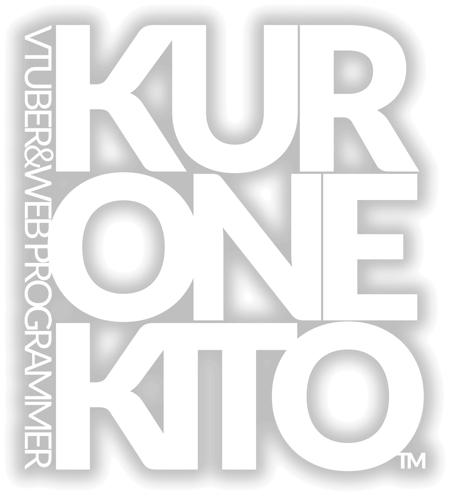

# 💿 ボカロ曲 “NULLRISE” のリソース

## 歌詞

- [SubViewer (`.sbv`) 形式の歌詞ファイル](https://github.com/kurone-kito/nullrise/raw/main/texts/lyrics.sbv)
- [Aegisub (`.ass`) 形式の歌詞ファイル](https://github.com/kurone-kito/nullrise/raw/main/texts/lyrics.ass)
- [YouTube カラオケ風字幕 (`.ytt`) 形式の歌詞ファイル](https://github.com/kurone-kito/nullrise/raw/main/texts/lyrics.ytt)

```txt
何処から現れた？知らない人たち
壊れた世界で本当のこと話してくれる？
何もかももうダメなんだ意味なんてないんだって
なるほどあーそうかもしれないけれども残念だったね笑

肝心なことほど解らないままで
失ってばっかの無駄でバカバカしい
人生模様だって解ってるけどごめんね
綺麗な泣き顔見たら
……放っとけないな。

だいたいやばいんだろ？理不尽きてるんだろ？
助けるしかないでしょ？？
やれるだけやってみるけどな
何が起きても受け入れるか笑うしかないや :D

さあ、飛び込もうぜぶち壊してやろうぜ
考えるのは暴れてからでしょ？

---

叶うことのない夢を見せるために
摺られて紡がれた犠牲たちなんて虚しい話
勿論知ってたつもりでも案外未確定なの？
こいつを壊せるまでは確かめられない！

たとえ全てが灰色に染まっても
その中で見つけた微かな輝きがまだ生きる理由になるから

---

結局何もない
どうせ終わってたって
それで大笑いでしょ？
やれるだけやってみるけどな
何が起きたって受け入れるか笑うしかないや

飛び込もうぜぶち壊してやろうぜ
考えるのは暴れてからでしょ？
```

## サウンド関係

### NULLRISE の音楽データ

ぜひ、あなたのスマホのボカロプレイリストへ！

- 45MB: [【ロスレス】Apple Lossless (ALAC M4A)](https://github.com/kurone-kito/nullrise/raw/main/sounds/nullrise.alac.m4a)
- 31MB: [【ロスレス】Free Lossless Audio Codec (FLAC)](https://github.com/kurone-kito/nullrise/raw/main/sounds/nullrise.flac)
- 8MB: [MPEG Audio layer-3 (MP3)](https://github.com/kurone-kito/nullrise/raw/main/sounds/nullrise.mp3)

### Instrumental (カラオケ)

歌みた向けのボカロなし版です。

- 45MB: [【ロスレス】Apple Lossless (ALAC M4A)](https://github.com/kurone-kito/nullrise/raw/main/sounds/instrument.alac.m4a)
- 31MB: [【ロスレス】Free Lossless Audio Codec (FLAC)](https://github.com/kurone-kito/nullrise/raw/main/sounds/instrument.flac)
- 8MB: [MPEG Audio layer-3 (MP3)](https://github.com/kurone-kito/nullrise/raw/main/sounds/instrument.mp3)

## 画像関係

### ロゴ

|                                              SVG                                              |                                              PNG                                              |
| :-------------------------------------------------------------------------------------------: | :-------------------------------------------------------------------------------------------: |
| [](https://github.com/kurone-kito/nullrise/raw/main/images/logo.svg) | [](https://github.com/kurone-kito/nullrise/raw/main/images/logo.png) |

### ジャケット

|                                                    1:1                                                    |                                                      16:9                                                       |
| :-------------------------------------------------------------------------------------------------------: | :-------------------------------------------------------------------------------------------------------------: |
| [](https://github.com/kurone-kito/nullrise/raw/main/images/artwork.webp) | [](https://github.com/kurone-kito/nullrise/raw/main/images/thumbnail.webp) |

|                                                  2:1                                                   |
| :----------------------------------------------------------------------------------------------------: |
| [](https://github.com/kurone-kito/nullrise/raw/main/images/header.webp) |

### 黒音キトのロゴ

必要に応じてご利用ください。(必須ではありません)

[](https://github.com/kurone-kito/nullrise/raw/main/images/kk-logo.png)

## ネタバレ

<details>
<summary><strong>【ネタバレ注意！】</strong>タップで表示</summary>

`E0HI-H4B5` == `PAST-SELF`

</details>

## ライセンス

ここにあるコンテンツは全て、
[CC-BY-4.0](https://creativecommons.org/licenses/by/4.0/deed.ja)
ライセンスの下で提供しております。

出典の明記のみお守りいただければ、無制限のご利用がいただけます。
